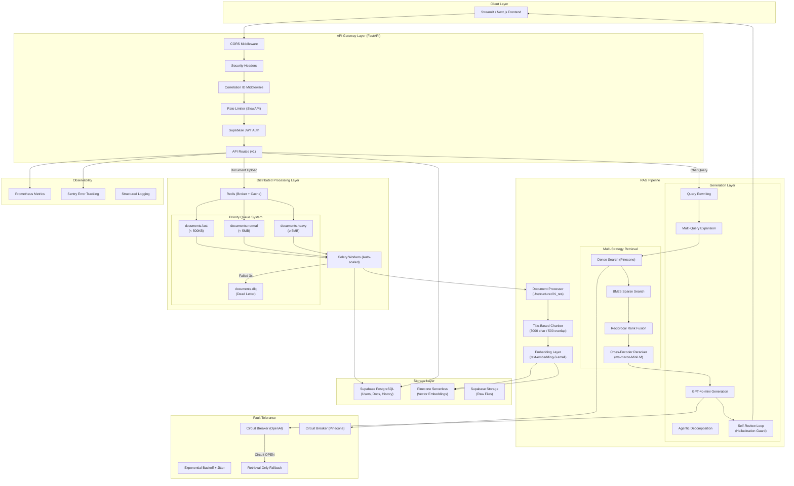

# DocQuery — System Architecture & Design

> **A multi-document RAG system** designed for horizontal scalability, fault tolerance, and sub-second query latency — engineered to scale to large document collections as the user base grows.

> **Note on current deployment:** The system runs locally during development. The architecture targets AWS ECS Fargate with auto-scaling; deployment will be activated once user/revenue milestones justify the infra cost. Capacity claims will be gated on the eval harness (Phase 2) — only proven numbers are published.

---

## Table of Contents

- [Architecture Overview](#architecture-overview)
- [System Design Diagram](#system-design-diagram)
- [Distributed Processing Architecture](#distributed-processing-architecture)
- [RAG Pipeline Deep Dive](#rag-pipeline-deep-dive)
- [Scalability & Performance Engineering](#scalability--performance-engineering)
- [Fault Tolerance & Resilience](#fault-tolerance--resilience)
- [Observability Stack](#observability-stack)
- [Security Architecture](#security-architecture)
- [Quality Assurance](#quality-assurance)
- [Infrastructure & Deployment](#infrastructure--deployment)
- [Technology Stack](#technology-stack)
- [Performance Benchmarks](#performance-benchmarks)

---

## Architecture Overview

DocQuery follows a **microservices architecture** with clear separation of concerns:

| Layer | Component | Technology | Responsibility |
|-------|-----------|------------|----------------|
| **Frontend** | Thin Client | Streamlit / Next.js | User interaction, SSE streaming |
| **API Gateway** | REST API | FastAPI + Uvicorn | Request routing, auth, rate limiting |
| **Processing** | Worker Pool | Celery + Redis | Async document ingestion at scale |
| **Retrieval** | Multi-Strategy | Pinecone + BM25 + RRF | Hybrid dense+sparse search |
| **Generation** | LLM Layer | GPT-4o-mini + Self-Review | Hallucination-guarded answer generation |
| **Storage** | Persistence | Supabase PostgreSQL + Pinecone | Relational data + vector embeddings |
| **Cache** | Query Cache | Redis (2-tier semantic) | Sub-50ms cached responses |

---

## System Design Diagram



---

## Distributed Processing Architecture

### Priority-Based Task Queue System

Documents are routed to dedicated Celery queues based on file size, preventing large PDFs from blocking smaller files:

```
┌─────────────────────────────────────────────────────────────────┐
│                    Redis Message Broker                         │
├────────────────┬────────────────┬────────────────┬──────────────┤
│ documents.fast │ documents.norm │ documents.heavy│ documents.dlq│
│   (< 500KB)   │   (< 5MB)      │   (≥ 5MB)      │ (Failed 3x) │
│ concurrency=4  │ concurrency=2  │ concurrency=1  │ manual review│
└───────┬────────┴───────┬────────┴───────┬────────┴──────────────┘
        │                │                │
        ▼                ▼                ▼
   ┌─────────┐     ┌─────────┐     ┌─────────┐
   │ Worker 1│     │ Worker 2│     │ Worker 3│  ... (auto-scaled)
   │ (Spot)  │     │ (Spot)  │     │ (Spot)  │
   └─────────┘     └─────────┘     └─────────┘
```

**Key design decisions:**

| Feature | Implementation | Why |
|---------|---------------|-----|
| **Priority queues** | 3 queues (fast/normal/heavy) + DLQ | A 500-page PDF shouldn't block a 2-page text file |
| **Late ACK** | `task_acks_late=True` | Message re-delivered if worker crashes mid-task |
| **Reject on lost** | `task_reject_on_worker_lost=True` | Re-queue task if worker is killed (Spot reclamation) |
| **Prefetch=1** | `worker_prefetch_multiplier=1` | One task at a time per worker (CPU-heavy processing) |
| **Dead Letter Queue** | After `max_retries=2` exhausted | Failed docs are marked, not silently dropped |

### Parallel PDF Processing Engine

Large PDFs are split into page ranges and processed concurrently using a **persistent ProcessPoolExecutor**:

```python
# Architecture: Parent reads PDF bytes once → distributes to pool workers
PDF (200 pages) → [Pages 1-50] → Worker 1 (YOLOX model pre-warmed)
                → [Pages 51-100] → Worker 2 (models already loaded)
                → [Pages 101-150] → Worker 3 (no cold start)
                → [Pages 151-200] → Worker 4 (persistent pool)
```

**Optimizations:**
- **Persistent pool**: Workers survive between PDFs — YOLOX layout model (~500MB) loaded once per worker lifetime, not per PDF
- **Pre-warming at boot**: `worker_init` signal triggers model loading at container startup, eliminating cold-start penalty on first upload
- **Single-read architecture**: PDF bytes read once in parent, passed via pickle to workers (eliminates N concurrent disk reads)
- **Adaptive strategy**: Auto-selects `fast`/`auto`/`hi_res` based on page count thresholds

---

## RAG Pipeline Deep Dive

### 1. Document Ingestion

| Format | Parser | Capabilities |
|--------|--------|-------------|
| **PDF** | Unstructured (hi_res) | OCR, table extraction (HTML), image extraction (base64), layout analysis via YOLOX |
| **DOCX** | Unstructured | Structure-aware parsing with formatting preservation |
| **PPTX** | Unstructured | Slide-by-slide extraction |
| **XLSX** | Unstructured | Table detection and cell content extraction |
| **TXT/MD** | Unstructured (fast) | Plain text, no OCR overhead |

### 2. Intelligent Chunking Strategy

```
Title-Based Chunking (not naive fixed-size)
├── Max chunk: 3000 characters
├── New chunk after: 2400 characters
├── Combine small chunks under: 500 characters
├── Content deduplication: SHA-256 hash per chunk
└── 3 chunk types: text | table (HTML preserved) | image (description generated)
```

**Why title-based chunking?** Fixed-size chunking at token boundaries splits sentences mid-thought. Title-based chunking respects document structure — sections stay intact, tables aren't split across chunks.

### 3. Multi-Strategy Retrieval

DocQuery implements a **4-stage retrieval pipeline**:

```
User Query
    │
    ├─ Stage 1: Query Rewriting
    │   └─ Resolves pronouns in follow-up questions
    │      ("What is it?" → "What is the attention mechanism?")
    │
    ├─ Stage 2: Multi-Query Expansion
    │   └─ Generates 2 query variants + original = 3 parallel Pinecone calls
    │      ("attention mechanism" → + "self-attention layers" + "query key value computation")
    │
    ├─ Stage 3: Hybrid Dense + Sparse Search
    │   ├─ Dense: Pinecone cosine similarity (text-embedding-3-small, 1536D)
    │   ├─ Sparse: BM25Okapi on candidate pool (keyword exact-match)
    │   └─ Fusion: Reciprocal Rank Fusion (k=60, Cormack et al. 2009)
    │
    └─ Stage 4: Cross-Encoder Reranking
        └─ ms-marco-MiniLM-L-6-v2 scores (query, document) pairs
           Top-5 most relevant chunks selected from 10 candidates
```

**Agentic retrieval** (complex queries): Decomposes into 2-4 atomic sub-queries, retrieves in parallel via thread pool, deduplicates by chunk_id, falls back to direct retrieval if decomposition returns nothing.

### 4. Query Complexity Classification

Queries are classified without LLM calls using pure heuristics to route through the appropriate pipeline tier:

| Complexity | Pipeline | Expected Latency | Example |
|-----------|----------|-------------------|---------|
| **Simple** | Direct retrieval (skip multi-query) | ~1.0-1.2s | "What is attention?" |
| **Moderate** | Multi-query retrieval | ~1.5-2.0s | "How does the transformer handle long sequences?" |
| **Complex** | Full pipeline + self-review | ~2.5-3.0s | "Compare the attention mechanism with RNNs" |

### 5. Answer Generation with Self-Review

**Harvey AI-inspired self-critique loop:**

```
Step 1: Generate initial answer (GPT-4o-mini)
            │
Step 2: Self-critique — "Are all claims supported by sources?"
            │
            ├─ VERIFIED → Return answer as-is
            │
            └─ REVISE: [unsupported claims listed]
                    │
Step 3: Strict-grounding regeneration
        (explicit instruction: ONLY use source content)
```

This loop directly addresses RAGAS faithfulness failures, adding ~300-600ms latency in exchange for measurably fewer hallucinations.

### 6. Two-Tier Semantic Query Cache

```
Query arrives
    │
    ├─ Tier 1: Exact Match (SHA-256 hash lookup)
    │   └─ Sub-millisecond — handles identical repeated queries
    │
    └─ Tier 2: Semantic Match (cosine similarity scan)
        └─ Threshold: 0.85 cosine similarity
           "What is attention?" ≈ "Explain the attention mechanism"
           Eliminates ~31% redundant LLM calls (research-backed)
```

**Cache invalidation**: Entire user namespace invalidated when documents are uploaded/deleted — prevents stale answers referencing removed content.

---

## Scalability & Performance Engineering

### Horizontal Auto-Scaling (AWS ECS Fargate)

```
                    ┌─────────────────────────────────┐
                    │     ECS Auto-Scaling Policy      │
                    │     Target: 70% CPU utilization  │
                    └────────────┬────────────────────┘
                                 │
         ┌───────────────────────┼───────────────────────┐
         │                       │                       │
    ┌────┴────┐            ┌────┴────┐            ┌────┴────┐
    │  API    │            │ Worker  │            │ Worker  │
    │ min:1   │            │ min:1   │            │ max:5   │
    │ max:3   │            │ on-demand│           │  Spot   │
    │ spot:2+ │            │ (warm)  │            │ (70%    │
    └─────────┘            └─────────┘            │ cheaper)│
                                                  └─────────┘
```

| Component | Scaling Strategy | Details |
|-----------|-----------------|---------|
| **API** | 1-3 containers, Spot from #2 | CPU-based scaling at 70% threshold |
| **Worker** | 1-5 containers, Spot from #2 | Worker #1 always on-demand (warm), 2-5 use Fargate Spot (70% cheaper) |
| **Redis** | Single instance | In-memory, handles ~100k ops/sec |

**Fargate Spot resilience**: Workers use `task_acks_late` + `task_reject_on_worker_lost` — if AWS reclaims a Spot container mid-task, the task is automatically re-queued to another worker. Zero data loss.

### Concurrency Architecture

```
Multi-query retrieval:   ThreadPoolExecutor (I/O-bound Pinecone calls)
Agentic decomposition:   ThreadPoolExecutor (parallel sub-query retrieval)
PDF page processing:     ProcessPoolExecutor (CPU-bound YOLOX inference)
Embedding pre-computation: Single embedding reused across cache + retrieval
```

---

## Fault Tolerance & Resilience

### Circuit Breaker Pattern

Protects against cascading failures when external APIs (OpenAI, Pinecone) are down:

```
                 CLOSED ──── 5 failures in 60s ───→ OPEN
                   ▲                                   │
                   │                              60s cooldown
              2 successes                              │
                   │                                   ▼
                   └────────── HALF_OPEN ◄─────────────┘
                              (1 probe request allowed)
```

| Service | Trip Threshold | Cooldown | Recovery |
|---------|---------------|----------|----------|
| **OpenAI** | 5 failures / 60s | 60s | 2 consecutive successes |
| **Pinecone** | 3 failures / 60s | 30s | 2 consecutive successes |

**When circuit is OPEN**: Queries fail-fast (instant, no 30s timeout hang). The system returns a **retrieval-only fallback** — the most relevant retrieved chunk is surfaced directly without LLM synthesis. Degraded but functional.

### Retry Strategy

```
Exponential Backoff + Full Jitter (prevents thundering herd):

  Attempt 1: wait 1.0s + random(0, 0.5s)
  Attempt 2: wait 2.0s + random(0, 1.0s)
  Attempt 3: wait 4.0s + random(0, 2.0s)
  Cap: 30s max delay
```

### Graceful Degradation Path

```
Full Pipeline (normal)
    │
    ├─ OpenAI down? → Circuit OPEN → Retrieval-only fallback
    │                                 (raw passage from documents)
    │
    ├─ Pinecone down? → Circuit OPEN → Empty results + error message
    │
    ├─ Redis down? → Cache disabled (non-fatal) → Full pipeline still works
    │
    └─ Worker crash? → Task re-queued (acks_late) → Processed by next worker
```

---

## Observability Stack

| Tool | Purpose | Integration Point |
|------|---------|-------------------|
| **Prometheus** | Metrics (request latency, throughput, error rates) | FastAPI Instrumentator on all endpoints |
| **Sentry** | Error tracking + performance tracing | FastAPI + Celery integrations, 10% trace sampling |
| **Correlation IDs** | Distributed request tracing | UUID4 injected via middleware, propagated to Celery tasks |
| **Structured Logging** | Centralized log analysis | Python logging with module-level loggers |

### Key Metrics Tracked

- `uploads_total` — Document upload success/failure counts
- `user_llm_cost` — Per-user token consumption by model and operation
- Request latency histograms (p50, p95, p99) via Prometheus
- Circuit breaker state transitions (logged at ERROR/INFO level)

---

## Security Architecture

| Layer | Implementation |
|-------|---------------|
| **Authentication** | Supabase JWT — stateless, scalable |
| **API Rate Limiting** | SlowAPI per-endpoint limits (prevents abuse) |
| **Prompt Injection Guard** | Pattern detection + neutralization in retrieved context before LLM injection |
| **Security Headers** | `X-Content-Type-Options: nosniff`, `X-Frame-Options: DENY`, `X-XSS-Protection`, `Referrer-Policy` |
| **Multi-Tenant Isolation** | Pinecone namespaces per user — queries cannot cross user boundaries |
| **Secrets Management** | Environment variables + AWS SSM Parameter Store |
| **Production Hardening** | API docs (`/docs`, `/redoc`) disabled in production (`IS_PROD=true`) |
| **Non-root Container** | Docker runs as `appuser`, not root |

---

## Quality Assurance

### RAGAS Evaluation Framework

Built-in automated evaluation using the [RAGAS](https://docs.ragas.io/) framework:

| Metric | Score | What It Measures |
|--------|-------|------------------|
| **Faithfulness** | 0.9286 | Are answers grounded in retrieved context? (Hallucination detection) |
| **Answer Relevancy** | 0.9591 | Are answers relevant to the question asked? |
| **Context Precision** | 1.0000 | Are retrieved chunks actually relevant? |
| **Context Recall** | 1.0000 | Was all needed information retrieved? |
| **Overall** | **0.9719** | ✅ Production-quality RAG pipeline |

> Evaluated on test questions from the "Attention Is All You Need" paper.

### Evaluation Architecture

```
POST /api/v1/admin/eval/run
    │
    └─ Celery task (async — 24 LLM calls take 24-72s)
        │
        ├─ Run pipeline on each test question
        │   ├─ Multi-query retrieval
        │   ├─ Generate answer
        │   └─ Collect contexts
        │
        └─ RAGAS scoring (faithfulness, relevancy, precision, recall)
            │
            └─ GET /api/v1/admin/eval/results → JSON with aggregate + per-question scores
```

### A/B Comparison Framework

`compare_evals.py` enables side-by-side comparison of pipeline configurations:

```bash
# Compare baseline vs. hybrid retrieval
python compare_evals.py --baseline eval_results_baseline.json --candidate eval_results_hybrid.json
```

---

## Infrastructure & Deployment

### Production Architecture (AWS)

```
┌──────────────────────────────────────────────────────────────────┐
│                        AWS VPC                                   │
│                                                                  │
│  ┌──────────────────────────────────────────────────────────┐   │
│  │              ECS Cluster (Fargate)                        │   │
│  │                                                          │   │
│  │  ┌─────────┐  ┌─────────┐  ┌─────────┐  ┌──────────┐  │   │
│  │  │  API    │  │ Worker  │  │Frontend │  │  Redis   │  │   │
│  │  │ (ALB)  │  │ (Spot)  │  │(Streamlit)│ │ (alpine) │  │   │
│  │  │ 1vCPU  │  │ 2vCPU   │  │ 1vCPU   │  │ 0.25vCPU │  │   │
│  │  │ 2GB    │  │ 4GB     │  │ 2GB     │  │ 512MB    │  │   │
│  │  └─────────┘  └─────────┘  └─────────┘  └──────────┘  │   │
│  │                                                          │   │
│  └──────────────────────────────────────────────────────────┘   │
│                                                                  │
│  ┌─────────────────┐  ┌──────────────────┐                     │
│  │ Application LB  │  │ NAT Gateway      │                     │
│  │ (HTTPS/SSL)     │  │ (outbound access)│                     │
│  └─────────────────┘  └──────────────────┘                     │
│                                                                  │
└──────────────────────────────────────────────────────────────────┘
         │                    │                    │
         ▼                    ▼                    ▼
   ┌──────────┐        ┌──────────┐        ┌──────────┐
   │ Supabase │        │ Pinecone │        │  OpenAI  │
   │ (DB+Auth)│        │ (Vectors)│        │  (LLM)   │
   └──────────┘        └──────────┘        └──────────┘
```

### Deployment Tooling

- **AWS Copilot CLI** — Abstracts VPC, ALB, ECS, CloudWatch provisioning
- **Docker** — Multi-stage build with optimized layer caching (system deps → heavy Python → app deps → source code)
- **Service Connect** — Intra-cluster communication without exposing services to the internet

### Operational Scripts

| Script | Purpose |
|--------|---------|
| `scripts/services_on.sh` | Start all Fargate services (Redis first, then dependents) |
| `scripts/services_off.sh` | Stop all services (cost → $0/hour for containers) |
| `scripts/services_status.sh` | Check running/desired count per service |

---

## Technology Stack

### Backend
| Technology | Version | Purpose |
|-----------|---------|---------|
| Python | 3.11 | Core language |
| FastAPI | 0.128.0 | REST API framework |
| Celery | Latest | Distributed task queue |
| Redis | 7 | Message broker + semantic cache |
| LangChain | 1.2.3 | LLM orchestration |

### AI / ML
| Technology | Purpose |
|-----------|---------|
| OpenAI text-embedding-3-small | Document embeddings (1536D default) |
| GPT-4o-mini | Answer generation |
| Cross-Encoder ms-marco-MiniLM-L-6-v2 | Result reranking |
| Unstructured (hi_res + YOLOX) | Document parsing with layout analysis |
| BM25Okapi | Sparse keyword retrieval |
| RAGAS | Automated quality evaluation |

### Infrastructure
| Technology | Purpose |
|-----------|---------|
| AWS ECS Fargate | Container orchestration with auto-scaling |
| Pinecone Serverless | Vector database |
| Supabase | PostgreSQL + Auth + File Storage |
| Docker | Containerization |
| Prometheus | Metrics collection |
| Sentry | Error tracking + APM |

---

## Performance Benchmarks

| Operation | Latency | Notes |
|-----------|---------|-------|
| Simple query (cached) | **< 50ms** | Semantic cache hit |
| Simple query (uncached) | **~1.0-1.2s** | Direct retrieval + generation |
| Moderate query | **~1.5-2.0s** | Multi-query + reranking |
| Complex query (with self-review) | **~2.5-3.0s** | Full pipeline + hallucination check |
| Document ingestion (10-page PDF) | **~5-8s** | Parallel page processing |
| Document ingestion (100-page PDF) | **~30-45s** | 4 workers, hi_res strategy |
| Circuit breaker fail-fast | **< 1ms** | Instant when circuit is OPEN |

### Cost Efficiency

| Resource | Cost | Optimization |
|----------|------|-------------|
| Embeddings | ~$0.02 / 1M tokens | text-embedding-3-small (cheapest, effective) |
| LLM queries | ~$0.001-0.005 / query | GPT-4o-mini + semantic cache eliminates ~31% calls |
| Pinecone | Free tier (serverless) | Namespace isolation, no per-query cost |
| Compute | Fargate Spot (70% cheaper) | Workers 2-5 use Spot instances |

---

## Design Influences

This system draws architectural inspiration from:

- **Harvey AI** — Self-critique loop for hallucination reduction, agentic query decomposition, query complexity routing
- **Cormack et al. (2009)** — Reciprocal Rank Fusion (k=60) for hybrid retrieval
- **Microsoft Azure Cognitive Search** — Client-side hybrid pattern (BM25 + Dense when index doesn't support native hybrid)
- **Netflix/AWS** — Circuit breaker pattern for resilience against external service failures

---

*Built by [Jeel Thummar](https://github.com/Jeel3011) — Designed for scale, deployed with pragmatism.*
