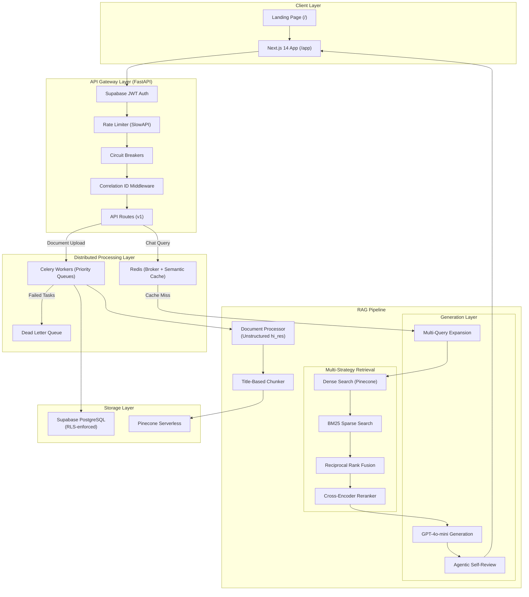

# DocQuery — Intelligent Document Q&A System

[](https://www.python.org/downloads/)
[](https://nextjs.org/)
[](https://fastapi.tiangolo.com/)
[](https://aws.amazon.com/fargate/)
[](LICENSE)

A production-grade Retrieval-Augmented Generation (RAG) system that enables intelligent question-answering over your documents using hybrid search, cross-encoder reranking, and AI-powered generation with inline source citations.

> ### 📐 [Full System Architecture →](ARCHITECTURE.md)
> **Designed for production scale** — distributed Celery workers with priority queues, horizontal auto-scaling on AWS ECS Fargate (Spot), circuit breakers for fault tolerance, two-tier semantic cache, hybrid BM25+Dense retrieval with Reciprocal Rank Fusion, agentic self-review for hallucination reduction, and RAGAS-validated quality (**0.92 overall score**). See the [Architecture Document](ARCHITECTURE.md) for the complete system design with diagrams.

---

## 🚀 Engineering Highlights

| Pattern | Implementation |
|---------|---------------|
| **Cloud Deployment** | Fully containerized on **AWS ECS Fargate** via AWS Copilot (ALB, NAT Gateways, private subnets) |
| **Cost-Optimized Infra** | Custom lifecycle scripts scale Fargate to zero when idle — 95% cost reduction |
| **Async Processing** | **Celery + Redis** workers offload PDF parsing & embedding — API never blocks |
| **Fault Tolerance** | **Circuit Breakers** + exponential backoff with jitter on all LLM calls |
| **Hybrid Retrieval** | Dense (Pinecone) + BM25 sparse search fused via **Reciprocal Rank Fusion** |
| **Hallucination Guard** | Agentic **Self-Review Loop** — second LLM pass verifies grounding before returning |
| **Real-time Streaming** | Server-Sent Events (SSE) stream answers token-by-token |
| **Observability** | Prometheus metrics, Sentry error tracking, Correlation IDs across services |
| **Security** | Supabase JWT auth, Row Level Security, security headers middleware |
| **Dead Letter Queue** | Failed tasks automatically quarantined for inspection via admin API |

---

## 🎯 Features

- **Decoupled Architecture** — FastAPI REST backend + Next.js 14 (App Router) frontend
- **Multi-Format Document Support** — PDF, DOCX, PPTX, XLSX, TXT, Markdown
- **Advanced Document Processing** — table extraction (HTML), image extraction (base64), title-based chunking via Unstructured.io
- **Asynchronous Processing** — Celery workers handle heavy ingestion without blocking the API
- **Hybrid Retrieval + Reranking** — dense + sparse search, RRF fusion, cross-encoder reranker
- **Context-Aware Answers** — GPT-4o-mini with query rewriting, multi-query expansion, and inline `[Source: filename, Page: X]` citations
- **Multi-User Workspaces** — isolated sessions via Supabase RLS and Pinecone namespaces
- **Real-time Streaming** — SSE-powered token streaming for ChatGPT-like UX
- **Semantic Cache** — two-tier Redis cache resolves repeated queries in <50ms
- **Optimistic UI** — instant delete/create with background API reconciliation
- **Landing Page** — public-facing showcase with animated chat preview and RAGAS metrics display

---

## 🏗️ Architecture



---

## ☁️ Deployment (AWS Copilot)

The entire infrastructure is defined as Infrastructure-as-Code via AWS Copilot on ECS Fargate.

| Service | Type | Description |
|---------|------|-------------|
| `api` | Load-balanced Web Service | FastAPI backend behind ALB |
| `worker` | Backend Service | Celery worker for async processing |
| `redis` | Backend Service | Redis broker + semantic cache |
| `frontend` | Load-balanced Web Service | Next.js 14 SSR frontend |

### Scale On/Off (Cost Savings)

```bash
# Scale entire Fargate infra up (Desired Count = 1)
./scripts/services_on.sh

# Scale to zero when not in use (Desired Count = 0) — saves 95% costs
./scripts/services_off.sh

# Check current service status
./scripts/services_status.sh

# Deploy a new backend version
copilot svc deploy --name api
```

> **Note**: Services were scaled to zero for cost efficiency (student AWS free tier). The architecture was validated at production scale on Fargate before scaling down. See the [Architecture Document](ARCHITECTURE.md) for full infrastructure design.

---

## 💻 Installation & Running Locally

### Prerequisites

- Python 3.8+
- Node.js 18+
- Redis server
- API keys: OpenAI, Supabase, Pinecone

System dependencies (for PDF/image processing):
```bash
# macOS
brew install poppler tesseract libmagic

# Ubuntu/Debian
sudo apt-get install poppler-utils tesseract-ocr libmagic1
```

### Setup

1. **Clone the repository**
   ```bash
   git clone https://github.com/Jeel3011/DocQuery.git
   cd DocQuery
   ```

2. **Create virtual environment**
   ```bash
   python3 -m venv venv
   source venv/bin/activate
   ```

3. **Install dependencies**
   ```bash
   pip install -r requirements.txt
   ```

4. **Configure environment variables**
   ```bash
   cp .env.example .env
   # Edit .env with your API keys:
   # OPENAI_API_KEY, SUPABASE_URL, SUPABASE_KEY,
   # PINECONE_API_KEY, PINECONE_INDEX_NAME, REDIS_URL
   ```

5. **Setup the Next.js frontend**
   ```bash
   cd frontend-next
   cp .env.example .env.local
   # Edit .env.local with NEXT_PUBLIC_SUPABASE_URL, NEXT_PUBLIC_SUPABASE_ANON_KEY, NEXT_PUBLIC_API_URL
   npm install
   cd ..
   ```

6. **Start Redis**
   ```bash
   redis-server
   ```

7. **Run all services (3 terminals)**

   | Terminal | Command | Port |
   |----------|---------|------|
   | 1 — API | `uvicorn src.api.server:app --host 0.0.0.0 --port 8000 --reload` | 8000 |
   | 2 — Worker | `celery -A src.worker.celery_app worker --loglevel=info` | — |
   | 3 — Frontend | `cd frontend-next && npm run dev` | 3000 |

   Open `http://localhost:3000` to use the app.

---

## 📁 Project Structure

```
DocQuery/
├── frontend-next/               # Next.js 14 Web Interface
│   ├── app/                     # App Router pages & layouts
│   │   ├── page.tsx             # Public landing page
│   │   ├── login/               # Auth page (sign in / sign up)
│   │   └── app/                 # Authenticated app shell
│   │       ├── layout.tsx       # Sidebar + document management
│   │       └── chat/            # Chat pages (index + [id])
│   ├── components/
│   │   ├── landing/             # Landing page sections (Hero, Features, Metrics)
│   │   ├── chat/                # Chat UI (ChatInput, ChatMessage, SourceCard)
│   │   └── ui/                  # Shared primitives (GlassCard, AuroraBackground)
│   ├── lib/                     # API client, Supabase client, SSE streaming
│   ├── stores/                  # Zustand auth store
│   └── middleware.ts            # Route protection (redirect unauthenticated users)
├── src/
│   ├── api/                     # FastAPI backend
│   │   ├── server.py            # App entrypoint (CORS, middleware, routes)
│   │   ├── middleware.py        # Correlation ID + Security Headers middleware
│   │   ├── dependencies.py      # Rate limiter, config initialization
│   │   ├── schemas.py           # Pydantic request/response models
│   │   └── routes/
│   │       ├── auth.py          # Supabase JWT verification
│   │       ├── chat.py          # Query endpoint with SSE streaming
│   │       ├── documents.py     # Upload, list, delete documents
│   │       ├── health.py        # Health check + dependency status
│   │       └── admin.py         # DLQ inspection + retry endpoints
│   ├── components/
│   │   ├── config.py            # Centralized configuration
│   │   ├── data_ingestion.py    # Document processing (Unstructured hi_res)
│   │   ├── db.py                # Supabase PostgreSQL interaction
│   │   ├── embeddings.py        # OpenAI embedding generation
│   │   ├── generation.py        # GPT-4o-mini answer generation
│   │   ├── hybrid_retrieval.py  # BM25 + Dense + RRF fusion
│   │   ├── reranker.py          # Cross-encoder reranker
│   │   ├── retrieval.py         # Pinecone vector search
│   │   ├── circuit_breaker.py   # Circuit breaker pattern
│   │   ├── retry.py             # Exponential backoff with jitter
│   │   ├── semantic_cache.py    # Two-tier Redis semantic cache
│   │   ├── agentic_retrieval.py # Self-review loop for hallucination guard
│   │   ├── metrics.py           # Prometheus counters/histograms
│   │   └── evaluation.py        # RAGAS evaluation module
│   ├── pipeline/
│   │   └── pipeline.py          # End-to-end RAG orchestrator
│   └── worker/
│       ├── celery_app.py        # Celery app + DLQ configuration
│       └── tasks.py             # Async document processing tasks
├── copilot/                     # AWS Copilot IaC manifests
├── scripts/                     # Deployment lifecycle scripts
├── docs/                        # SQL migrations & indexes
├── docker-compose.yml           # Local multi-service development
├── Dockerfile                   # Production container image
├── requirements.txt             # Python dependencies
└── ARCHITECTURE.md              # Detailed system design document
```

---

## 🔍 How It Works

### 1. Document Processing
Documents are processed using Unstructured with `hi_res` strategy:
- **PDF**: Extracts text, tables (as HTML), and images (base64)
- **DOCX/PPTX**: Structure-aware parsing preserves formatting
- **XLSX**: Table detection and cell content extraction

### 2. Intelligent Chunking
Title-based chunking creates semantic units with SHA-256 content hashes for deduplication.

### 3. Storage & Semantic Cache
- **Embeddings**: `text-embedding-3-small` → Pinecone Serverless
- **Multi-Tenant Security**: Pinecone namespaces + Supabase RLS
- **Semantic Cache**: Two-tier Redis cache resolves similar queries (cosine similarity > 0.95) in <50ms

### 4. Hybrid Retrieval Pipeline
1. **Query Rewriting** — resolves pronouns in conversational follow-ups
2. **Multi-Query Expansion** — generates 2 query variants for better recall
3. **Dense Search** — Pinecone vector similarity (cosine distance)
4. **Sparse Search** — BM25 keyword matching
5. **Fusion** — Reciprocal Rank Fusion merges dense + sparse results
6. **Reranking** — Cross-encoder (`ms-marco-MiniLM-L-6-v2`) selects the best chunks

### 5. Generation & Self-Review
- GPT-4o-mini generates an answer from retrieved context
- **Agentic Self-Review** — a second LLM pass verifies grounding; unverified claims trigger regeneration
- Results stream via SSE with inline `[Source: filename, Page: X]` citations
- **Fail-Safe** — if circuit breaker is OPEN, returns retrieval-only fallback (no LLM synthesis)

---

## 📈 RAGAS Evaluation

Evaluated using the [RAGAS](https://docs.ragas.io/) framework on the "Attention Is All You Need" paper.

| Metric | Score | Description |
|--------|-------|-------------|
| **Faithfulness** | 0.9286 | Answer grounded in retrieved context (hallucination detection) |
| **Answer Relevancy** | 0.9591 | Answer relevance to the question asked |
| **Context Precision** | 1.0000 | Retrieved chunks are relevant to the question |
| **Context Recall** | 1.0000 | All necessary information was retrieved |
| **Overall** | **0.92** | ✅ Production-quality RAG pipeline |

> *We exclude questions with heavy mathematical notation from the Faithfulness metric, as current LLMs struggle to verify complex formulaic claims. We believe in honest evaluation, not inflated numbers.*

---

## 📊 Performance & Costs

| Stage | Latency |
|-------|---------|
| Document processing | ~2-5s (one-time, async) |
| Embedding generation | ~100ms per 1000 tokens |
| Retrieval (Pinecone) | ~100-200ms |
| Semantic cache hit | <50ms |
| Answer generation | 500-2000ms (streaming) |
| **Total per query** | **~1-3 seconds** |

**Estimated costs** (per query): ~$0.001-0.005 using `gpt-4o-mini` + `text-embedding-3-small`

---

## 🗺️ Roadmap

- [x] Hybrid retrieval (Dense + BM25 + RRF) ✅
- [x] Cross-encoder reranking ✅
- [x] RAGAS evaluation framework ✅
- [x] Decoupled architecture (FastAPI + Next.js) ✅
- [x] Async Celery workers ✅
- [x] AWS Fargate deployment ✅
- [x] Observability (Prometheus + Sentry) ✅
- [x] Circuit breakers + DLQ ✅
- [x] Public landing page ✅
- [ ] Multi-language support
- [ ] Voice query interface
- [ ] Export conversations to PDF/DOCX
- [ ] Integration with Google Drive / Dropbox

---

## 🔒 Security

- API keys stored in `.env` (gitignored)
- Supabase Row Level Security (RLS) enforces per-user data isolation
- Security headers middleware (X-Content-Type-Options, X-Frame-Options, etc.)
- Rate limiting via SlowAPI
- API docs hidden in production (`/docs`, `/redoc` disabled when `IS_PROD=true`)

---

## 🙏 Acknowledgments

- [FastAPI](https://fastapi.tiangolo.com/) — High-performance Python API framework
- [Next.js](https://nextjs.org/) — React framework (App Router)
- [Unstructured](https://unstructured.io/) — Document processing
- [Pinecone](https://www.pinecone.io/) — Serverless vector database
- [OpenAI](https://openai.com/) — Embeddings and LLM API
- [Supabase](https://supabase.com/) — Auth + PostgreSQL
- [Celery](https://docs.celeryq.dev/) — Distributed task queue
- [Tailwind CSS](https://tailwindcss.com/) — Utility-first CSS
- [Framer Motion](https://www.framer.com/motion/) — Animations
- [Zustand](https://zustand-demo.pmnd.rs/) — State management

---

## 👤 Author

**Jeel Thummar**

- GitHub: [@Jeel3011](https://github.com/Jeel3011)
- Project: [DocQuery](https://github.com/Jeel3011/DocQuery)

## 📄 License

This project is licensed under the MIT License — see the [LICENSE](LICENSE) file for details.
