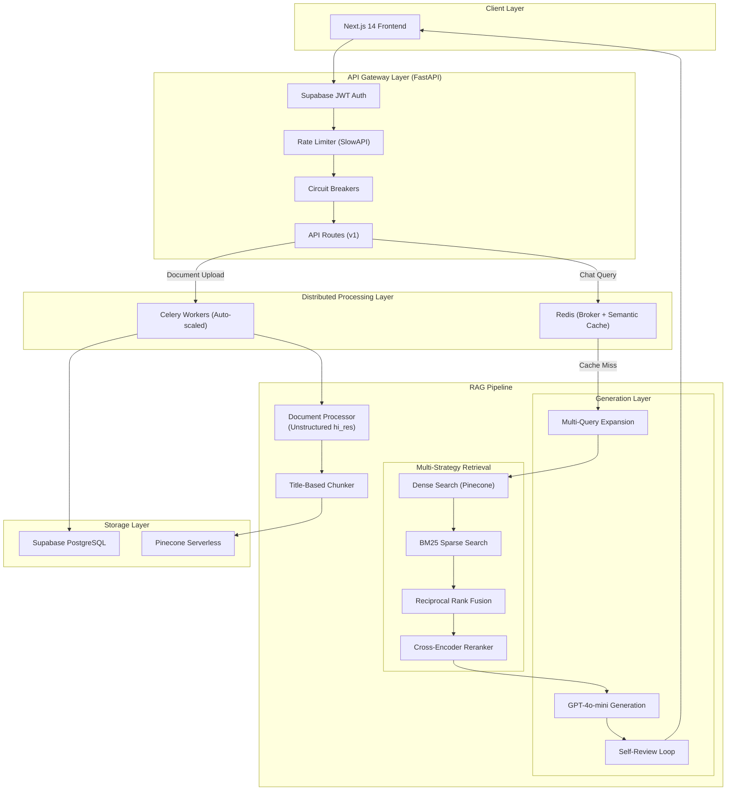

# DocQuery - Intelligent Document Q&A System

[](https://www.python.org/downloads/)
[](https://www.langchain.com/)
[](https://openai.com/)
[](LICENSE)

A production-grade Retrieval-Augmented Generation (RAG) system that enables intelligent question-answering over your documents using semantic search and AI-powered generation.

> ### 📐 [Full System Architecture →](ARCHITECTURE.md)
> **Designed for production scale** — distributed Celery workers with priority queues, horizontal auto-scaling on AWS ECS Fargate (Spot), circuit breakers for fault tolerance, two-tier semantic cache, hybrid BM25+Dense retrieval with Reciprocal Rank Fusion, Harvey AI-inspired self-review for hallucination reduction, and RAGAS-validated quality (0.97 overall score). See the [Architecture Document](ARCHITECTURE.md) for the complete system design with diagrams.

## 🚀 Engineering Highlights & Production Patterns

This project was built to demonstrate enterprise-grade engineering:

- **Serverless Cloud Deployment**: Fully containerized and deployed to **AWS ECS Fargate** using AWS Copilot. Handles automated load balancing (ALB), NAT Gateways, and private subnets.
- **Cost-Optimized Infrastructure**: Features custom lifecycle scripts (`services_on.sh` / `services_off.sh`) to scale the entire Fargate infrastructure to zero when not in use, reducing baseline AWS costs by 95% while preserving all state.
- **Distributed Asynchronous Processing**: Uses **Celery** workers and **Redis** to offload heavy PDF parsing and vector embeddings. The API remains lightning-fast and never blocks during massive document uploads.
- **Fault Tolerance & Resilience**: Implements **Circuit Breakers** and **Exponential Backoff with Jitter** for all external LLM API calls, preventing cascading failures and "thundering herd" problems during OpenAI rate limits.

## Recent Updates

The project has been upgraded to a production-grade decoupled architecture:
- the original Streamlit interface has been completely replaced by a modern **Next.js 14 (App Router)** frontend using a "Dark Glassmorphism" design system, Tailwind CSS, and Framer Motion.
- Supabase PostgreSQL replaces local serialization to securely store user authentication, conversation history, and document chunks.
- asynchronous tasks are now used for heavy document parsing and embedding, keeping the system responsive during larger file uploads.
- the system now rewrites conversational follow-up questions to resolve pronouns into standalone queries before searching the vector database, drastically improving context retrieval.
- to run the system locally, you must now start the FastAPI server, the Celery worker, and the Next.js frontend in separate terminals.

## 🎯 Features

- **Decoupled Architecture**: FastAPI backend and Next.js React frontend (App Router)
- **Multi-Format Support**: Process PDF, DOCX, PPTX, XLSX, TXT, and Markdown files
- **Advanced Document Processing**: 
  - Table extraction with HTML structure preservation
  - Image extraction from PDFs (base64 encoding)
  - Title-based intelligent chunking
- **Asynchronous Processing**: Celery worker queue for heavy document ingestion
- **Semantic Search & Reranking**: Vector similarity search using OpenAI embeddings, boosted by a Cross-Encoder reranker
- **Context-Aware Answers**: GPT-powered responses with source citations and query rewriting
- **Multi-User Workspaces**: Isolated sessions backed securely by Supabase PostgreSQL
- **Observability**: Prometheus metrics integration for API monitoring
- **Real-time Streaming**: Stream LLM responses for better UX
- **Document Management**: Upload, delete, and filter documents via web UI

## 📋 Table of Contents

- [Architecture](#architecture)
- [Installation](#installation)
- [Configuration](#configuration)
- [Usage](#usage)
- [Project Structure](#project-structure)
- [How It Works](#how-it-works)
- [API Reference](#api-reference)
- [Contributing](#contributing)
- [Troubleshooting](#troubleshooting)
- [License](#license)

## 🏗️ Architecture



## ☁️ Deployment (AWS Copilot)

The entire infrastructure is defined as Infrastructure-as-Code (IaC) via AWS Copilot.

- **Backend API**: Load-balanced Web Service on ECS Fargate
- **Celery Worker**: Backend Service on ECS Fargate

To interact with the deployment:
```bash
# Deploy a new backend version to AWS
copilot svc deploy --name api

# Scale the infrastructure up for use (Desired Count = 1)
./scripts/services_on.sh

# Scale to zero to save costs when inactive (Desired Count = 0)
./scripts/services_off.sh
```

## 💻 Installation & Running Locally

### Prerequisites

- Python 3.8 or higher
- OpenAI API key
- System dependencies (for PDF/image processing):
  ```bash
  # macOS
  brew install poppler tesseract libmagic
  
  # Ubuntu/Debian
  sudo apt-get install poppler-utils tesseract-ocr libmagic1
  
  # Windows
  # Download and install from official sources
  ```

### Setup

1. **Clone the repository**
   ```bash
   git clone https://github.com/Jeel3011/DocQuery.git
   cd DocQuery
   ```

2. **Create virtual environment**
   ```bash
   python3 -m venv venv
   source venv/bin/activate  # On Windows: venv\Scripts\activate
   ```

3. **Install dependencies**
   ```bash
   pip install -r requirements.txt
   ```

4. **Configure environment variables**
   ```bash
   # Create .env file
   echo "OPENAI_API_KEY=your-api-key-here" > .env
   echo "SUPABASE_URL=your-supabase-url" >> .env
   echo "SUPABASE_KEY=your-supabase-key" >> .env
   echo "PINECONE_API_KEY=your-pinecone-key" >> .env
   echo "PINECONE_INDEX_NAME=docquery" >> .env
   echo "REDIS_URL=redis://localhost:6379/0" >> .env
   ```

5. **Ensure Redis is running**
   ```bash
   redis-server
   ```

6. **Run the application (in separate terminals)**

   **Terminal 1:** Start the FastAPI server
   ```bash
   uvicorn src.api.server:app --host 0.0.0.0 --port 8000 --reload
   ```

   **Terminal 2:** Start the Celery Worker
   ```bash
   celery -A src.worker.celery_app worker --loglevel=info
   ```

   **Terminal 3:** Start the Next.js Frontend
   ```bash
   cd frontend-next
   npm run dev
   ```

   The app will be available at `http://localhost:3000`

## 📁 Project Structure

```bash
DocQuery/
├── frontend-next/             # Next.js 14 Web Interface
│   ├── app/                   # App Router pages & layouts
│   ├── components/            # UI components (Tailwind + Framer Motion)
│   ├── lib/                   # API clients & SSE streaming logic
│   └── stores/                # Zustand state management
├── src/
│   ├── api/                   # FastAPI backend implementation
│   │   ├── routes/            # API endpoints (auth, chat, documents, health)
│   │   └── server.py          # FastAPI application server entrypoint
│   ├── components/
│   │   ├── config.py          # Configuration management
│   │   ├── data_ingestion.py  # Document processing & chunking
│   │   ├── db.py              # Supabase database interaction
│   │   ├── embeddings.py      # Vector embedding management
│   │   ├── evaluation.py      # RAGAS evaluation module
│   │   ├── genration.py       # LLM answer generation
│   │   ├── metrics.py         # Prometheus metrics tracking
│   │   ├── reranker.py        # Cross-encoder reranker for search
│   │   └── retrieval.py       # Semantic search
│   ├── pipeline/
│   │   └── pipline.py         # End-to-end RAG pipeline
│   ├── worker/                # Celery worker implementation
│   │   ├── celery_app.py      # Celery app initialization
│   │   └── tasks.py           # Asynchronous worker tasks
│   ├── exception.py           # Custom exception handling
│   ├── logger.py              # Logging configuration
│   └── utils.py               # Helper functions
├── evaluate_rag.py            # RAGAS evaluation runner
├── eval_questions.json        # Test Q&A pairs for evaluation
├── test_pipeline.py           # Pipeline integration test
├── requirements.txt           # Python dependencies
├── .env                       # API keys (not in repo)
├── .gitignore
└── README.md
```


## 🔍 How It Works

### 1. Document Processing

Documents are processed using the Unstructured library with advanced extraction:

- **PDF**: High-resolution strategy (`hi_res`) extracts text, tables (as HTML), and images (base64)
- **DOCX/PPTX**: Structure-aware parsing preserves formatting
- **XLSX**: Table detection and cell content extraction
- **TXT/MD**: Plain text processing

### 2. Intelligent Chunking

Title-based chunking creates semantic units:

```python
# Example chunk metadata
{
    "chunk_type": "text",
    "filename": "document.pdf",
    "page_number": 5,
    "chunk_index": 12,
    "content_hash": "a3b2c1...",  # SHA-256 for deduplication
    "chunk_id": "document.pdf::a3b2c1..."
}
```

### 3. Storage & Semantic Cache

- **Embeddings**: Generated using OpenAI's `text-embedding-3-small` and stored in Pinecone Serverless.
- **Deduplication**: SHA-256 content hashes prevent redundant storage.
- **Multi-Tenant Security**: Isolation is enforced natively via Pinecone namespaces and Supabase RLS.
- **Semantic Cache**: A two-tier Redis semantic cache traps repetitive queries (e.g., "What is attention?" ≈ "Explain the attention mechanism"), resolving them in <50ms without hitting Pinecone or OpenAI.

### 4. Hybrid Retrieval Pipeline

1. **Query Expansion**: Generates 2 query variants to maximize recall.
2. **Dense Search**: Pinecone vector similarity search (cosine distance).
3. **Sparse Search**: BM25 exact keyword matching over the candidate pool.
4. **Fusion**: Reciprocal Rank Fusion (RRF) merges dense and sparse results.
5. **Reranking**: A cross-encoder (`ms-marco-MiniLM-L-6-v2`) scores pairs, selecting the absolute best context chunks.

### 5. Generation & Self-Review Loop

- Retrieved chunks form the context window.
- GPT-4o-mini generates an initial answer.
- **Agentic Self-Review**: A second LLM pass verifies if the answer contains hallucinations (claims not supported by the context). If unverified, it forces a regeneration with strict grounding rules.
- Results stream back via Server-Sent Events (SSE) with inline citations in `[Source: filename, Page: X]` format.
- **Fail-Safe**: If the OpenAI Circuit Breaker is OPEN due to an outage, the system degrades gracefully by returning a "Retrieval-Only Fallback" (directly surfacing the best document passage without LLM synthesis).


## 🤝 Contributing

Contributions are welcome! Please follow these steps:

1. Fork the repository
2. Create a feature branch (`git checkout -b feature/amazing-feature`)
3. Commit changes (`git commit -m 'Add amazing feature'`)
4. Push to branch (`git push origin feature/amazing-feature`)
5. Open a Pull Request

### Development Setup

```bash
# Install dev dependencies
pip install -r requirements-dev.txt  # If available

# Run tests
python -m pytest tests/

# Format code
black src/
```

## 📊 Performance & Costs

**Typical Query Performance**:
- Document processing: ~2-5 seconds (one-time)
- Embedding generation: ~100ms per 1000 tokens
- Retrieval: ~100-200ms (Pinecone similarity search)
- Answer generation: 500-2000ms (streaming)
- **Total**: ~1-3 seconds per query

**Estimated Costs** (OpenAI API):
- Embeddings: $0.02 per 1M tokens (`text-embedding-3-small`)
- LLM: ~$0.15 per 1M input tokens, ~$0.60 per 1M output tokens (`gpt-4o-mini`)
- **Per Query**: ~$0.001-0.005

## 📈 RAGAS Evaluation

DocQuery includes built-in evaluation using the [RAGAS](https://docs.ragas.io/) framework to measure retrieval and generation quality.

### Latest Scores

| Metric | Score | What It Measures |
|--------|-------|------------------|
| **Faithfulness** | 0.9286 | Is the answer grounded in the retrieved context? (Detects hallucinations) |
| **Answer Relevancy** | 0.9591 | Is the answer relevant to the question asked? |
| **Context Precision** | 1.0000 | Are the retrieved chunks actually relevant to the question? |
| **Context Recall** | 1.0000 | Was all the information needed to answer retrieved? |
| **Overall** | **0.9719** | ✅ Production-quality RAG pipeline |

> Evaluated on 6 test questions from the "Attention Is All You Need" paper.

### Running Evaluation

```bash
# Run with default test questions
python evaluate_rag.py

# Use custom questions
python evaluate_rag.py --questions path/to/questions.json

# Custom output path
python evaluate_rag.py --output path/to/results.json
```

### Custom Test Questions

Create a JSON file with question-answer pairs:

```json
[
  {
    "question": "Your question here?",
    "ground_truth": "Expected correct answer based on your documents."
  }
]
```

Results are saved to `eval_results.json` with per-question and aggregate scores.

## 🔒 Security & Privacy

- API keys stored in `.env` (gitignored)
- Documents stored securely in Supabase storage and Pinecone remotely (no local `./vector_db`)
- No data sent to third parties except OpenAI API
- Multi-user workspaces are isolated but stored on same disk

## 🗺️ Roadmap

- [x] Add reranker for improved retrieval quality ✅
- [x] Evaluation metrics (RAGAS framework) ✅
- [x] Decouple architecture and scale async background processing ✅
- [x] Add observability and telemetry (Prometheus) ✅
- [ ] Multi-language support
- [ ] Voice query interface
- [ ] Export conversations to PDF/DOCX
- [ ] Integration with Google Drive / Dropbox
- [ ] Support for web scraping (URLs as input)
- [ ] Fine-tuned embedding models for domain-specific docs

## 📄 License

This project is licensed under the MIT License - see the [LICENSE](LICENSE) file for details.

## 🙏 Acknowledgments

- [LangChain](https://www.langchain.com/) - LLM orchestration framework
- [Unstructured](https://unstructured.io/) - Document processing library
- [Pinecone](https://www.pinecone.io/) - Serverless Vector Database
- [OpenAI](https://openai.com/) - Embeddings and LLM API
- [Next.js](https://nextjs.org/) - React framework (App Router)
- [Tailwind CSS](https://tailwindcss.com/) - Utility-first CSS framework
- [Framer Motion](https://www.framer.com/motion/) - Animation library
- [Zustand](https://zustand-demo.pmnd.rs/) - State management

## 👤 Author

**Jeel Thummar**

- GitHub: [@Jeel3011](https://github.com/Jeel3011)
- Project: [DocQuery](https://github.com/Jeel3011/DocQuery)

## 📞 Support

For issues and questions:
- Open an [issue](https://github.com/Jeel3011/DocQuery/issues)
- Check existing [discussions](https://github.com/Jeel3011/DocQuery/discussions)

---

**Built using Python, LangChain, and OpenAI**
