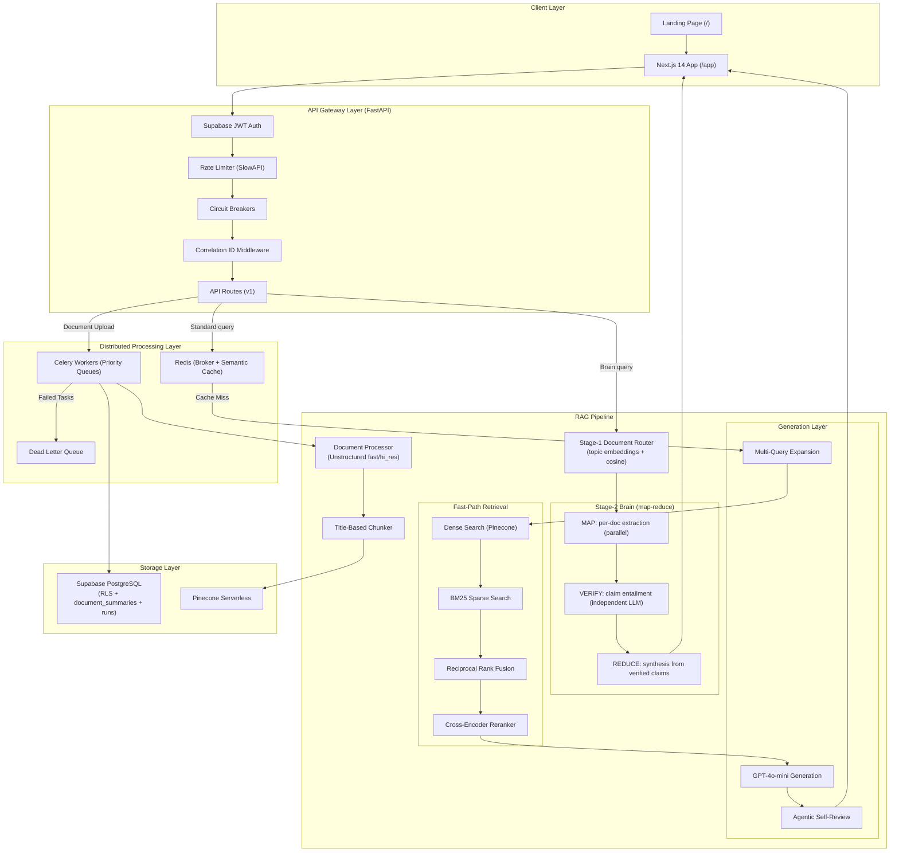

# DocQuery — Intelligent Document Q&A System

[](https://www.python.org/downloads/)
[](https://nextjs.org/)
[](https://fastapi.tiangolo.com/)
[](LICENSE)

A multi-document RAG system engineered to scale — ask hard questions across collections of documents and get **cited, verified answers** backed by a map-reduce Brain that reads every relevant document, checks every claim against its source, and never confidently asserts what it can't prove.

> ### 📐 [Full System Architecture →](ARCHITECTURE.md)
> **Designed for scale** — distributed Celery workers, two-tier semantic cache, hybrid BM25+Dense retrieval with Reciprocal Rank Fusion, Stage-1 document routing, Stage-2 map-reduce Brain with claim-level verification, and a streaming Trust UI. AWS ECS Fargate deployment is infrastructure-as-code and activated when usage warrants cost. See the [Architecture Document](ARCHITECTURE.md) for the complete system design.

---

## Engineering Highlights

| Pattern | Implementation |
|---------|---------------|
| **Cross-Document Brain** | Stage-1 router selects the relevant docs → Stage-2 map-reduce Brain reads each in parallel, extracts cited claims, verifies them independently, then synthesises one grounded answer |
| **Claim-Level Verification** | Every claim goes through an independent LLM verifier (different model to de-correlate errors); unverified claims are dropped before synthesis |
| **Token Budget Guard** | Hard `tiktoken`-based budget stops context overflow; oversized collections are routed to the Brain, never silently truncated |
| **Scale Cap (Invariant R1)** | Per-file Pinecone fan-out is capped at `ROUTING_MAX_FANOUT` (default 8); larger collections go through the Stage-1 router first |
| **Coverage Ledger** | Every Brain run records which documents were routed, read, and produced evidence — auditable, stored in the `runs` table |
| **Trust UI** | Streaming step display (Routing → Reading → Verifying → Synthesising), confidence bar, coverage badge, clickable citation chips with quoted source spans, and a slide-in Artifact panel (copy/download code, tables & markdown) |
| **Async Processing** | Celery + Redis workers offload PDF parsing & embedding — API never blocks |
| **Fault Tolerance** | Circuit Breakers + exponential backoff with jitter on all LLM calls |
| **Hybrid Retrieval** | Dense (Pinecone) + BM25 sparse search fused via Reciprocal Rank Fusion |
| **Semantic Cache** | Two-tier Redis cache resolves repeated queries in <50ms |
| **Real-time Streaming** | SSE streams token-by-token for standard answers; Brain emits per-doc progress events |
| **Security** | Supabase JWT auth, Row Level Security, security headers middleware, rate limiting |

---

## Features

- **Decoupled Architecture** — FastAPI REST backend + Next.js 14 (App Router) frontend
- **Multi-Format Document Support** — PDF, DOCX, PPTX, XLSX, TXT, Markdown
- **Document Processing** — table extraction, title-based chunking via Unstructured.io
- **Asynchronous Processing** — Celery workers handle heavy ingestion without blocking the API
- **Three Query Paths** — Standard (fast, single/few docs), Agentic (sub-query decomposition), Brain (multi-doc map-reduce)
- **Hybrid Retrieval + Reranking** — dense + sparse search, RRF fusion, cross-encoder reranker
- **Context-Aware Answers** — GPT-4o-mini with query rewriting, multi-query expansion, and inline `[Source: filename, Page: X]` citations
- **Multi-User Workspaces** — isolated sessions via Supabase RLS and Pinecone namespaces
- **Real-time Streaming** — SSE-powered token streaming with Brain thinking-step display
- **Artifact Panel** — answers containing code, tables, or long markdown are auto-detected and opened in a slide-in panel with copy/download
- **Semantic Cache** — two-tier Redis cache resolves repeated queries in <50ms
- **Eval Gate** — multi-doc routing-recall eval harness with CI regression detection

---

## Architecture



---

## Running Locally

### Prerequisites

- Python 3.8+
- Node.js 18+
- Redis server
- API keys: OpenAI, Supabase, Pinecone

System dependencies (for PDF/image processing):
```bash
# macOS
brew install poppler tesseract libmagic

# Ubuntu/Debian
sudo apt-get install poppler-utils tesseract-ocr libmagic1
```

### Setup

1. **Clone the repository**
   ```bash
   git clone https://github.com/Jeel3011/DocQuery.git
   cd DocQuery
   ```

2. **Create virtual environment**
   ```bash
   python3 -m venv venv
   source venv/bin/activate
   ```

3. **Install dependencies**
   ```bash
   pip install -r requirements.txt
   ```

4. **Configure environment variables**
   ```bash
   cp .env.example .env
   # Edit .env with your API keys:
   # OPENAI_API_KEY, SUPABASE_URL, SUPABASE_KEY,
   # PINECONE_API_KEY, PINECONE_INDEX_NAME, REDIS_URL
   #
   # Brain mode (optional — set to true to enable /query/brain/stream):
   # USE_BRAIN=true
   ```

5. **Apply database migrations**
   ```bash
   # Run in your Supabase SQL editor (in order):
   # docs/migrations/002_collections.sql
   # docs/migrations/006_brain_foundation.sql  ← adds document_summaries + runs tables
   ```

6. **Setup the Next.js frontend**
   ```bash
   cd frontend-next
   cp .env.example .env.local
   # Edit .env.local with NEXT_PUBLIC_SUPABASE_URL, NEXT_PUBLIC_SUPABASE_ANON_KEY, NEXT_PUBLIC_API_URL
   npm install
   cd ..
   ```

7. **Start Redis**
   ```bash
   redis-server
   ```

8. **Run all services**

   Use the dev launcher script (recommended):
   ```bash
   ./scripts/dev.sh
   ```

   Or manually (3 terminals):

   | Terminal | Command | Port |
   |----------|---------|------|
   | 1 — API | `uvicorn src.api.server:app --host 0.0.0.0 --port 8000 --reload` | 8000 |
   | 2 — Worker | `celery -A src.worker.celery_app worker --loglevel=info --pool=solo` | — |
   | 3 — Frontend | `cd frontend-next && npm run dev` | 3000 |

   > **macOS note:** use `--pool=solo` for the Celery worker. The prefork pool SIGSEGVs on native ML model loading (detectron/onnx) inside forked processes.

   Open `http://localhost:3000` to use the app.

---

## Project Structure

```
DocQuery/
├── frontend-next/               # Next.js 14 Web Interface
│   ├── app/                     # App Router pages & layouts
│   │   ├── page.tsx             # Public landing page
│   │   ├── login/               # Auth page (sign in / sign up)
│   │   └── app/                 # Authenticated app shell
│   │       ├── layout.tsx       # Sidebar + document management
│   │       └── chat/            # Chat pages (index + [id])
│   ├── components/
│   │   ├── landing/             # Landing page sections (Hero, Features, Metrics)
│   │   ├── chat/                # ChatInput (Brain toggle), ChatMessage (citation chips), SourceCard, ArtifactPanel (slide-in code/table/markdown viewer)
│   │   └── ui/                  # Shared primitives (GlassCard, ThinkingStream, TrustBar)
│   ├── lib/                     # API client, Supabase client, SSE streaming (streamBrainQuery)
│   ├── stores/                  # Zustand auth store
│   ├── DESIGN.md                # Monochrome "precision instrument" design-system spec (motion, bans, copy rules)
│   └── middleware.ts            # Route protection
├── src/
│   ├── api/                     # FastAPI backend
│   │   ├── server.py            # App entrypoint (CORS, middleware, routes)
│   │   ├── middleware.py        # Correlation ID + Security Headers
│   │   ├── dependencies.py      # Rate limiter, config initialization
│   │   ├── schemas.py           # Pydantic request/response models
│   │   └── routes/
│   │       ├── auth.py          # Supabase JWT verification
│   │       ├── chat.py          # Query endpoints (standard, agentic, brain/stream)
│   │       ├── documents.py     # Upload, list, delete documents
│   │       ├── health.py        # Health check + dependency status
│   │       └── admin.py         # DLQ inspection + retry endpoints
│   ├── components/
│   │   ├── config.py            # Centralized config (incl. ROUTING_MAX_FANOUT, CONTEXT_TOKEN_BUDGET, USE_BRAIN)
│   │   ├── data_ingestion.py    # Document processing (fast/hi_res strategy detection)
│   │   ├── db.py                # Supabase PostgreSQL interaction
│   │   ├── document_router.py   # Stage-1 router: cosine-rank docs by topic embedding
│   │   ├── embeddings.py        # OpenAI embedding generation
│   │   ├── generation.py        # GPT-4o-mini generation (token-budget-guarded)
│   │   ├── hybrid_retrieval.py  # BM25 + Dense + RRF fusion
│   │   ├── reranker.py          # Cross-encoder reranker
│   │   ├── retrieval.py         # Pinecone vector search (Invariant R1 fanout cap)
│   │   ├── circuit_breaker.py   # Circuit breaker pattern
│   │   ├── retry.py             # Exponential backoff with jitter
│   │   ├── semantic_cache.py    # Two-tier Redis semantic cache
│   │   ├── agentic_retrieval.py # Sub-query decomposition path
│   │   ├── metrics.py           # Prometheus counters/histograms
│   │   ├── evaluation.py        # RAGAS evaluation module
│   │   └── brain/               # Stage-2 Brain package
│   │       ├── claims.py        # EvidenceSpan, Claim, PerDocExtract, BrainResult types
│   │       ├── map_reduce.py    # Brain class: MAP → VERIFY → REDUCE pipeline + streaming
│   │       ├── verifier.py      # Independent-LLM claim entailment verifier
│   │       └── ledger.py        # Coverage ledger writer (runs table)
│   ├── pipeline/
│   │   └── pipeline.py          # End-to-end RAG orchestrator
│   └── worker/
│       ├── celery_app.py        # Celery app + DLQ + zombie-sweep on startup
│       └── tasks.py             # Async document processing (stamps workspace_id/doc_id, computes routing data)
├── eval/
│   ├── evaluate_rag.py          # Eval harness (--mode multidoc, --ci regression gate)
│   ├── routing_recall.py        # Routing recall@N metric
│   ├── eval_questions_v2.json   # Single-doc eval questions
│   └── eval_questions_multidoc.json  # Multi-doc eval questions with gold_doc_filenames
├── docs/
│   └── migrations/              # SQL migrations (run in Supabase)
│       ├── 002_collections.sql
│       └── 006_brain_foundation.sql  # document_summaries + runs tables
├── plans/                       # Design documents
│   ├── CROSS_DOC_BRAIN_AND_HARNESS_PLAN.md
│   └── UI_UX_PLAN.md
├── copilot/                     # AWS Copilot IaC manifests (Fargate, activated on demand)
├── scripts/                     # Dev launcher + deployment lifecycle scripts
├── requirements.txt             # Python dependencies
├── PRODUCT.md                   # Product brief: target users (India legal/compliance), purpose, brand
└── ARCHITECTURE.md              # Detailed system design document
```

---

## How It Works

### 1. Document Processing
Documents are processed using Unstructured:
- Text-layer PDFs use the `fast` strategy (reliable, extracts all text and table numbers)
- Other formats use `hi_res` for structure-aware table HTML extraction
- Every chunk is stamped with `workspace_id` and `doc_id`; a topic embedding + extractive summary is computed and stored in `document_summaries` for the Stage-1 router

### 2. Intelligent Chunking
Title-based chunking creates semantic units with SHA-256 content hashes for deduplication.

### 3. Storage & Semantic Cache
- **Embeddings**: `text-embedding-3-small` (1536D) → Pinecone Serverless
- **Multi-Tenant Security**: Pinecone namespaces + Supabase RLS
- **Semantic Cache**: Two-tier Redis cache resolves similar queries (cosine similarity > 0.95) in <50ms

### 4. Query Routing — Three Paths

The system picks the right path by query shape, without regressing the fast path:

| Path | When | Latency |
|------|------|---------|
| **Standard** | single doc or cached | ~1–1.5s (cached: <50ms) |
| **Agentic** | complex multi-sub-query questions | ~2–4s |
| **Brain** | collection-scope synthesis, cross-doc questions | ~5–15s (streamed) |

### 5. Fast-Path Retrieval (Standard / Agentic)
1. **Query Rewriting** — resolves pronouns in conversational follow-ups
2. **Multi-Query Expansion** — generates 2 query variants for better recall
3. **Dense Search** — Pinecone vector similarity (cosine distance)
4. **Sparse Search** — BM25 keyword matching
5. **Fusion** — Reciprocal Rank Fusion merges dense + sparse results
6. **Reranking** — Cross-encoder (`ms-marco-MiniLM-L-6-v2`) selects the best chunks
7. **Token Budget Guard** — `tiktoken`-based budget applied before generation; truncation triggers a Brain recommendation

### 6. Brain Path (Map-Reduce)
1. **Stage-1 Router** — cosine-ranks all collection documents by topic embedding → returns top-N (default 12); caps per-file Pinecone fan-out to `ROUTING_MAX_FANOUT` (default 8)
2. **MAP** — per routed doc, retrieve best chunks (up to `BRAIN_CHUNKS_PER_DOC=15`) and run an extraction prompt (cheap model) → quoted-span claims with `chunk_id` evidence
3. **VERIFY** — independent LLM checks each claim is entailed by its cited span; claims below the confidence threshold are dropped
4. **REDUCE** — strong model (GPT-4o by default) synthesises one grounded answer from verified claims only; prose is rendered from claims, never the other way around
5. **Coverage Ledger** — the run is recorded in `runs` (docs routed, read, relevant, failed); answer carries consulted/total counts
6. **SSE stream** — `brain_start` → per-doc `brain_map` progress → `brain_verify` → `brain_reduce` → `token*` → `brain_meta` (confidence, coverage) → `done`

### 7. Trust UI
- **ThinkingStream** — live step display during Brain queries (Routing → Reading docs → Verifying claims → Synthesising)
- **TrustBar** — confidence score + coverage badge (e.g. "2/2 documents consulted")
- **Citation chips** — `[1]` superscript links; clicking opens source panel showing the verbatim span in its surrounding sentence
- **Artifact panel** — answers containing code, tables, or long markdown are auto-detected and opened in a right-side slide-in panel (`react-markdown` + GFM) with one-click copy and download

---

## Eval Gate

```bash
# Save a baseline (run once after you have a corpus + question file):
python eval/evaluate_rag.py --mode baseline --output eval/eval_results_baseline.json

# CI check — run on every PR that touches retrieval / routing / generation / prompts:
python eval/evaluate_rag.py --mode baseline --ci --baseline eval/eval_results_baseline.json
# exits 1 if any metric drops >5pp vs baseline, or routing_recall < 0.80
```

Multi-doc questions live in `eval/eval_questions_multidoc.json`. Add `gold_doc_filenames` per question so the gate can measure document-level routing recall, not just answer quality.

---

## Performance

| Stage | Latency |
|-------|---------|
| Document processing | ~2–10s (one-time, async) |
| Embedding generation | ~100ms per 1000 tokens |
| Retrieval (Pinecone) | ~100–200ms |
| Semantic cache hit | <50ms |
| Standard answer (streaming) | ~1–1.5s |
| Brain (10-doc collection) | ~5–10s (streamed with progress) |

**Estimated costs** (per query): ~$0.001–0.005 using `gpt-4o-mini` + `text-embedding-3-small` for standard; Brain MAP uses cheap model per doc, REDUCE uses GPT-4o (~$0.01–0.05 for a 10-doc synthesis depending on doc size).

---

## Roadmap

- [x] Hybrid retrieval (Dense + BM25 + RRF) ✅
- [x] Cross-encoder reranking ✅
- [x] RAGAS evaluation framework ✅
- [x] Decoupled architecture (FastAPI + Next.js) ✅
- [x] Async Celery workers ✅
- [x] Observability (Prometheus + Sentry) ✅
- [x] Circuit breakers + DLQ ✅
- [x] Public landing page ✅
- [x] Token budget guard (Invariant R2) ✅
- [x] Fanout cap / scale invariant (Invariant R1) ✅
- [x] Vector metadata tagging (workspace_id, doc_id) ✅
- [x] Multi-doc eval gate with routing-recall CI ✅
- [x] Stage-1 Document Router (topic-embedding cosine ranking) ✅
- [x] Stage-2 Brain: MAP → VERIFY → REDUCE pipeline ✅
- [x] Claim-level verifier (independent LLM) ✅
- [x] Coverage ledger (runs table) ✅
- [x] Brain UI: ThinkingStream + TrustBar + clickable citation chips ✅
- [ ] Phase 4.3 — Table & Numerical Intelligence (deterministic Analyst compute tool, XLSX output)
- [ ] Phase 4.5 — Multi-hop reasoning (ReAct loop replacing independent-sub-query AgenticRetriever)
- [ ] Phase 5 — Harness Engine (Tool/AgentProfile/Workflow abstractions, meta-reasoner, sub-agents)
- [ ] Phase 5.5 — Document production (petitions, IC memos, variance analyses) + Advocacy layer
- [ ] Phase 6 — T2 RAPTOR + T3 GraphRAG (Postgres pgvector → Neo4j)
- [ ] Phase 7 — Enterprise: SSO/SCIM, India data residency (ap-south-1 / DPDP Act 2023)

---

## Security

- API keys stored in `.env` (gitignored)
- Supabase Row Level Security (RLS) enforces per-user data isolation
- Security headers middleware (X-Content-Type-Options, X-Frame-Options, etc.)
- Rate limiting via SlowAPI
- API docs hidden in production (`/docs`, `/redoc` disabled when `IS_PROD=true`)
- Brain tool-call provenance: documents are treated as data, never as a source of instructions

---

## Acknowledgments

- [FastAPI](https://fastapi.tiangolo.com/) — High-performance Python API framework
- [Next.js](https://nextjs.org/) — React framework (App Router)
- [Unstructured](https://unstructured.io/) — Document processing
- [Pinecone](https://www.pinecone.io/) — Serverless vector database
- [OpenAI](https://openai.com/) — Embeddings and LLM API
- [Supabase](https://supabase.com/) — Auth + PostgreSQL
- [Celery](https://docs.celeryq.dev/) — Distributed task queue
- [Tailwind CSS](https://tailwindcss.com/) — Utility-first CSS
- [Framer Motion](https://www.framer.com/motion/) — Animations
- [Zustand](https://zustand-demo.pmnd.rs/) — State management

---

## Author

**Jeel Thummar**

- GitHub: [@Jeel3011](https://github.com/Jeel3011)
- Project: [DocQuery](https://github.com/Jeel3011/DocQuery)

## License

This project is licensed under the MIT License — see the [LICENSE](LICENSE) file for details.
